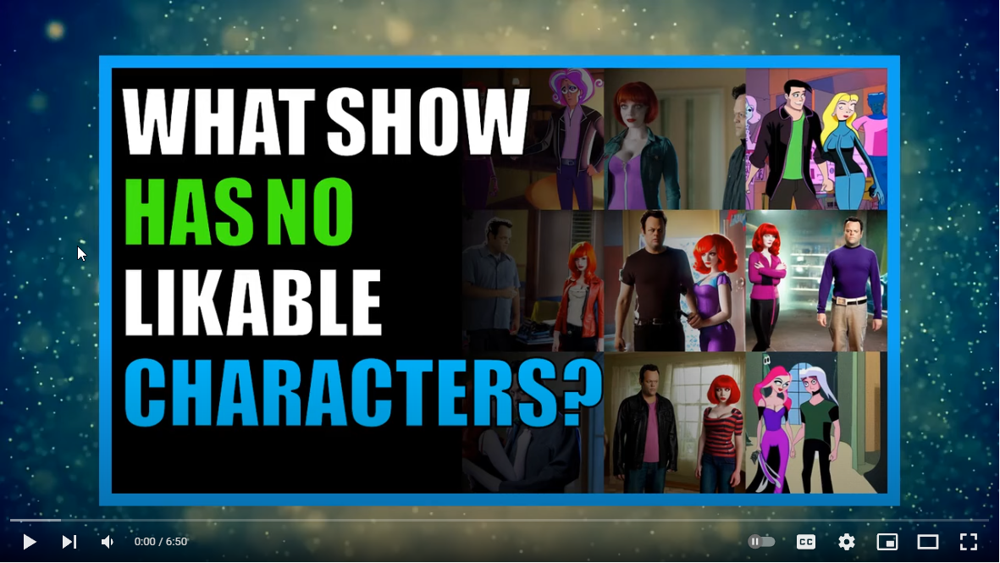
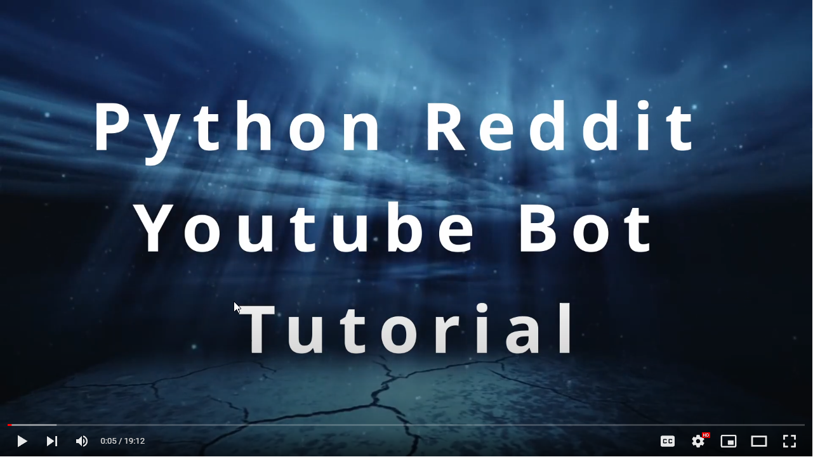
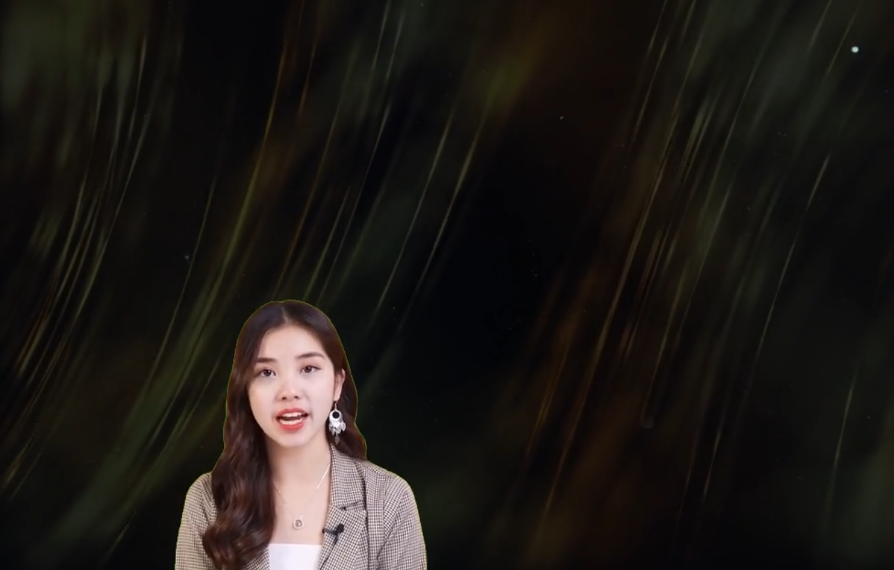

# Automated Reddit to Youtube Bot

<!-- vscode-markdown-toc -->
* [Description](#description)
* [Example Videos](#example-videos)
* [Reddit Youtube Channels](#reddit-youtube-channels)
* [Install Prerequisite Components](#install-prerequisite-components)
* [Git clone repository](#git-clone-repository)
* [Generate Reddit Tokens](#generate-reddit-tokens)
* [Copy auth config](#copy-auth-config)
* [Python Pip Install Dependencies](#python-pip-install-dependencies)
* [Install Playwright](#install-playwright)
* [Run Python Script](#run-python-script)
* [Generate a Video for a Specific Post](#generate-a-video-for-a-specific-post)
* [Generate Only Thumbnails](#generate-only-thumbnails)
* [Enable a Newscaster](#enable-a-newscaster)
* [Settings.py File](#settings.py-file)

<!-- vscode-markdown-toc-config
	numbering=false
	autoSave=true
	/vscode-markdown-toc-config -->
<!-- /vscode-markdown-toc -->

## <a name='description'></a>Description

Scrape posts from Reddit and automatically generate Youtube Videos and Thumbnails

## <a name='example-videos'></a>Example Videos

Checkout my Youtube Channel for example videos made by this repo :

[What crime are you okay with people committing?](https://youtu.be/gOX1Uhxba-g)
[](https://youtu.be/gOX1Uhxba-g)

[What show has no likable characters?](https://youtu.be/xAaPbntOVb8)
[](https://youtu.be/xAaPbntOVb8)

## <a name='reddit-youtube-channels'></a>Reddit Youtube Channels

Youtube Channels generated using this repo :
* [TTSVibeLounge](https://www.youtube.com/@ttsvibelounge/videos)
* [Aussie Banter Reddit](https://www.youtube.com/@AussieBanterReddit)

If your Youtube Channel is generated using this repository and you would like it listed above please comment on this issue https://github.com/alexlaverty/python-reddit-youtube-bot/issues/91 with your youtube channel url and channel name and mention you'd like it listed in the main README file.

  
# Quickstart Guide

# Windows


[Watch the Python Reddit Youtube Bot Tutorial Video :](https://youtu.be/LaFFU9EskfA)
[](https://youtu.be/LaFFU9EskfA)

## <a name='install-prerequisite-components'></a>Install Prerequisite Components

Install these prerequisite components first :

* Git - https://git-scm.com/download/win

* Python 3.10 - https://www.python.org/ftp/python/3.10.0/python-3.10.0-amd64.exe

* Microsoft C++ Build Tools - https://visualstudio.microsoft.com/visual-cpp-build-tools/

* ImageMagick - https://imagemagick.org/script/download.php#windows

## <a name='git-clone-repository'></a>Git clone repository

```
git clone git@github.com:alexlaverty/python-reddit-youtube-bot.git
cd python-reddit-youtube-bot
```

## <a name='generate-reddit-tokens'></a>Generate Reddit Tokens

Generate Reddit PRAW Tokens - https://www.reddit.com/prefs/apps/

## <a name='copy-auth-config'></a>Copy auth config

Create a copy of the auth-example.py file and name it auth.py :

```
copy config/auth-example.py config/auth.py
```

Update the `auth.py` file to contain the Reddit Auth tokens you generated in the previous step.

## <a name='python-pip-install-dependencies'></a>Python Pip Install Dependencies

```
pip install -r requirements.txt
```

## <a name='install-playwright'></a>Install Playwright

Install and configure playwright by running :

```
playwright install
```

## <a name='run-python-script'></a>Run Python Script

Run the python script :

```
python app.py
```

when it completes the video will be generated into the `videos` folder and will be named `final.mp4`

# Downloading video backgrounds using yt-dlp :

If you want to add a video background then install yt-dlp :

[yt-dlp](https://github.com/yt-dlp/yt-dlp/releases/latest/download/yt-dlp.exe)

then create a `backgrounds` folder and run the following command :

```
mkdir -p assets/backgrounds
cd assets/backgrounds
yt-dlp --playlist-items 1:10 -f 22 --output "%(uploader)s_%(id)s.%(ext)s" https://www.youtube.com/playlist?list=PLGmxyVGSCDKvmLInHxJ9VdiwEb82Lxd2E
```

# Help

You can view available parameters by passing in `--help` :

```
python app.py --help

##### YOUTUBE REDDIT BOT #####
usage: app.py [-h] [-l VIDEO_LENGTH] [-o] [-s] [-t] [-u URL]

options:
  -h, --help            show this help message and exit
  -l VIDEO_LENGTH, --video-length VIDEO_LENGTH
                        Set how long you want the video to be
  -o, --disable-overlay
                        Disable video overlay
  -s, --story-mode      Generate video for post title and selftext only, disables user comments
  -t, --thumbnail-only  Generate thumbnail image only
  -u URL, --url URL     Specify Reddit post url, seperate with a comma for multiple posts.
```

## <a name='generate-a-video-for-a-specific-post'></a>Generate a Video for a Specific Post

or if you want to generate a video for a specific reddit post you can specify it via the `--url` param :

```
python app.py --url https://www.reddit.com/r/AskReddit/comments/hvsxty/which_legendary_reddit_post_comment_can_you_still/
```

or you can do multiple url's by seperating with a comma, ie :

```
python app.py --url https://www.reddit.com/r/post1,https://www.reddit.com/r/post2,https://www.reddit.com/r/post3
```

## <a name='generate-only-thumbnails'></a>Generate Only Thumbnails

if you want to generate only thumbnails you can specify `--thumbnail-only` mode, this will skip video compilation process :

```
python app.py --thumbnail-only
```

## <a name='enable-a-newscaster'></a>Enable a Newscaster

If you want to enable a Newscaster, edit settings.py and set :

```
enable_newscaster = True
```



If the newcaster video has a green screen you can remove it with the following settings,
use an eye dropper to get the RGB colour of the greenscreen and set it to have it removed :

```
newscaster_remove_greenscreen = True
newscaster_greenscreen_color = [1, 255, 17] # Enter the Green Screen RGB Colour
newscaster_greenscreen_remove_threshold = 100
```

## <a name='settings.py-file'></a>Settings.py File

Theres quite a few options you can customise in the `settings.py` file :

Specify which subreddits you want to scrape :

```
subreddits = [
    "AmItheAsshole",
    "antiwork",
    "AskMen",
    "ChoosingBeggars",
    "hatemyjob",
    "NoStupidQuestions",
    "pettyrevenge",
    "Showerthoughts",
    "TooAfraidToAsk",
    "TwoXChromosomes",
    "unpopularopinion",
    "confessions",
    "confession"
    ]
```

Subreddits to exclude :

```
subreddits_excluded = [
    "r/CFB",
]
```

Filter out reddit posts via specified keywords

```
banned_keywords =["my", "nasty", "keywords"]
```

Change the Text to Speech engine you want to use, note AWS Polly requires and AWS account and auth tokens and can incur costs :

Supports Speech Engines :

* [AWS Polly](https://aws.amazon.com/polly/)
* [Balcon](http://www.cross-plus-a.com/bconsole.htm)
* Python [gtts](https://gtts.readthedocs.io/en/latest/)

```
# choices "polly","balcon","gtts"
voice_engine = "polly"
```

Total number of reddit Videos to generate

```
total_posts_to_process = 5
```

The next settings are to automatically filter out posts

Skip reddit posts that less than this amount of updates

```
minimum_submission_score = 5000
```

Filtering out reddit posts based on the reddit post title length

```
title_length_minimum = 20
title_length_maximum = 100
```

Filter out posts that exceed the maximum self text length

```
maximum_length_self_text = 5000
```

Filter out reddit posts that don't have enough comments

```
minimum_num_comments = 200
```

Only attempt to process a maximum amount of reddit posts

```
submission_limit = 1000
```

Specify how many thumbnail images you want to generate

```
number_of_thumbnails = 3
```

Specify the maximum video length

```
max_video_length = 600 # Seconds
```

Specify maximum amount of comments to generate in the video

```
comment_limit = 600
```

Specifying various folder paths

```
assets_directory = "assets"
temp_directory = "temp"
audio_directory = str(Path("temp"))
fonts_directory = str(Path(assets_directory,"fonts"))
image_backgrounds_directory = str(Path(assets_directory,"image_backgrounds"))
images_directory = str(Path(assets_directory,"images"))
thumbnails_directory = str(Path(assets_directory,"images"))
background_directory = str(Path(assets_directory,"backgrounds"))
video_overlay_filepath = str(Path(assets_directory,"particles.mp4"))
videos_directory = "videos"
```

Specify video height and width

```
video_height = 720
video_width = 1280
clip_size = (video_width, video_height)
```

Skip compiling the video and just exit instead

```
enable_compilation = True
```

Skip uploading to youtube

```
enable_upload = False
```

Add a video overlay to the video, for example snow falling effect

```
enable_overlay = True
```

Add in a newscaster reader to the video

```
enable_newscaster = True
```

If newcaster video is a green screen attempt to remove the green screen

```
newscaster_remove_greenscreen = True
```

Specify the color of the green screen in RGB

```
newscaster_greenscreen_color = [1, 255, 17] # Enter the Green Screen RGB Colour
```

The higher the greenscreen threshold number the more it will attempt to remove

```
newscaster_greenscreen_remove_threshold = 100
```

Path to newcaster file

```
newscaster_filepath = str(Path(assets_directory,"newscaster.mp4").resolve())
```

Position on the screen of the newscaster

```
newscaster_position = ("left","bottom")
```

The size of the newscaster

```
newcaster_size = (video_width * 0.5, video_height * 0.5)
```

Add a pause after each text to speech audio file

```
pause = 1 # Pause after speech
```

Text style settings

```
text_bg_color = "#1A1A1B"
text_bg_opacity = 1
text_color = "white"
text_font = "Verdana-Bold"
text_fontsize = 32
```

Download images from lexica or skip trying to download

```
lexica_download_enabled = True
```

