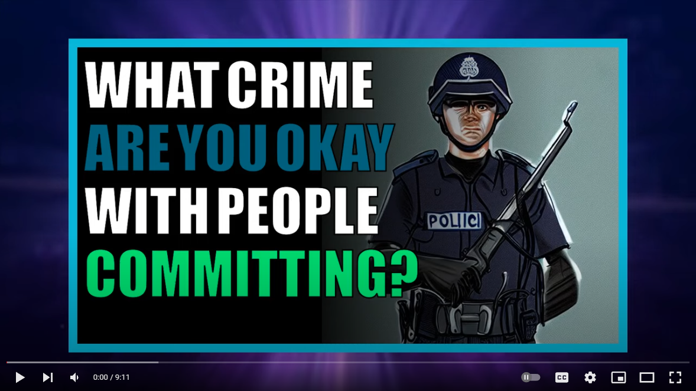

# Automated Reddit to Youtube Bot 

## Description 

Scrape posts from Reddit and automatically generate Youtube Videos and Thumbnails


## Example Videos 

Checkout my Youtube Channel for example videos made by this repo :

[](https://youtu.be/xhE8bFqBAw0)


I have also been working on integrating art generated by artificial intelligence into these automated videos :

[](https://youtu.be/nCjYH3ETXNo)


## Usage :

Copy config file, and populate it with Reddit PRAW and AWS Polly auth tokens  :

```
cp config-example.py config.py
```

Look into your youtube channel in chrome and then use this plugin to export the cookie :

[Export cookie JSON file for Puppeteer](https://chrome.google.com/webstore/detail/%E3%82%AF%E3%83%83%E3%82%AD%E3%83%BCjson%E3%83%95%E3%82%A1%E3%82%A4%E3%83%AB%E5%87%BA%E5%8A%9B-for-puppet/nmckokihipjgplolmcmjakknndddifde)

Save the cookie in this repo with filename `cookies.json`

Download video backgrounds using youtube-dl :

```
cd assets/backgrounds
yt-dlp -f 22 --output "%(uploader)s_%(id)s.%(ext)s" https://www.youtube.com/playlist?list=PLGmxyVGSCDKvmLInHxJ9VdiwEb82Lxd2E
```

Make sure you have Docker installed and then run the following 

```
docker-compose up
```

